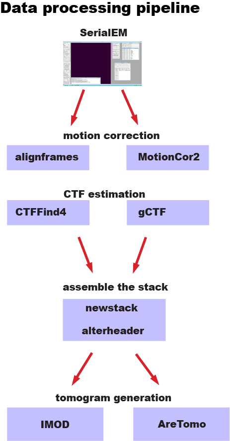

## Tomography Pipeline

Last updated 1/18/2023

Workflow described from `prepareSerialEMTilt.py` from the cryo-pipeliner GitHub repository.

### Description

Tomography data collections are typically made in SerialEM, where multiple regions are selected to be imaged on the sample.  At a region of interest (ROI), a tilt-series data collection is made where a low-dose image is recorded at a series of tilts typically from -65 to +65 degrees with increments of 3 degrees betweent the steps.  The software is setup to save the images (typically .tiff or .mrc) in a folder and keeps an associated metadata file called *.mdoc.

The workflow for processing this image data handles basic preprocessing (motion correction), builds a stack of images into a single file, and then does a GPU-accelerated reconstruction of a 3D volume to create a tomogram.

### Required user inputs

1. Instrument information (voltage, spherical aberration, amplitude contrast).
2. How to use a gain image (rotations or flips required).
2. Motion correction (whether to exclude any frames).
3. Location of the data (folders of tilt-series collections) and gain images.

### Overall Diagram

### Task: Prepare Gain Reference

1. Input typically (tiff or MRC)
2. Output is an MRC image at matching dimensions as movies to preprocessing and gain correct.
3. Output is console and error logs.

### Task: Motion Correction

1. Input is movies (tiff, MRC, or EER) format and gain reference.
2. Parameters that describe how to run motion correction.
3. Output is an MRC image (single frame) in the MRC format.
4. Output is console and error logs.

### Task: CTF Estimation

1. Input is an MRC image file.
2. Output is a descriptive data about the CTF estimated resolution and/or image of fourier transformed image showing Thon rings.
3. Output is console and error logs.

### Task: Newstack

1. Input is a list of image files.
2. Output is a single MRC file containing multiple images (a stack) that is ordered by angle.
3. Output can also be a metadata file such as .mdoc describing the contents of the MRC.
4. Output is console and error logs.

### Task: AreTomo

1. Input is a stack of images.
2. Input is a descriptive files of dose and angles for these images.
3. Parameters that describe how to run AreTomo.
4. Output is an MRC of a 3D volume reconstructed by AreTomo.
5. Output is console and error logs. 
