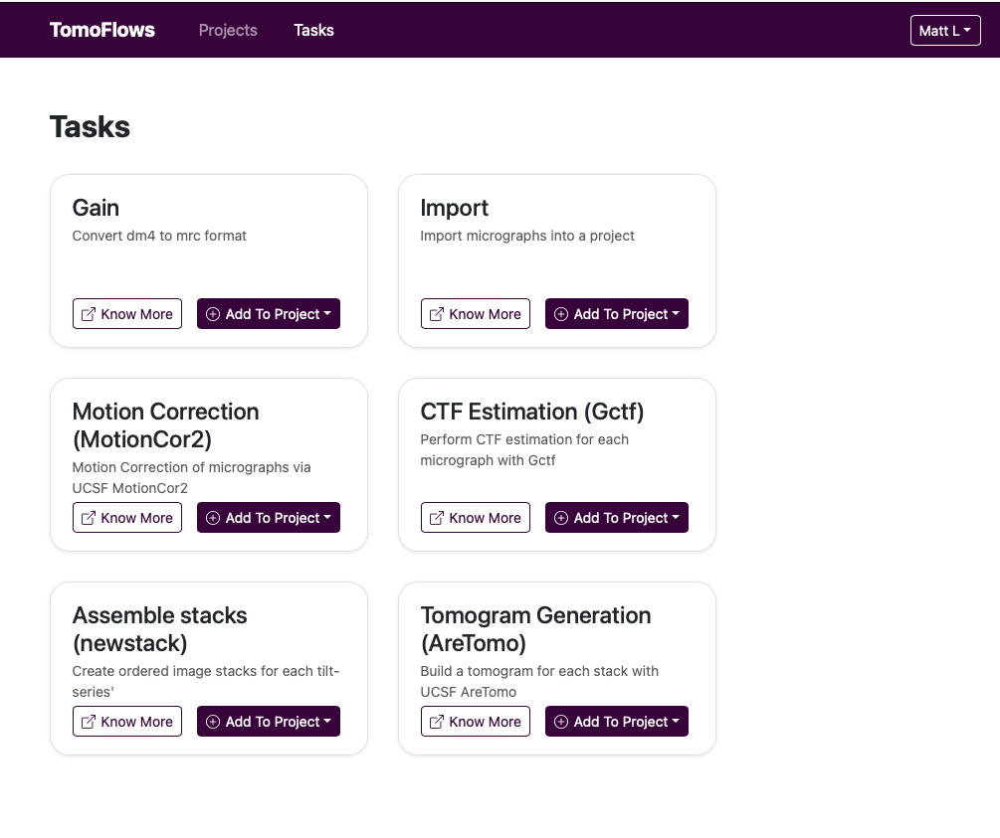

# TomoFlows

TomoFlows is a web-based UI for a task-based processing pipeline for Cryo-EM tomographic dataflows, intended for facility and independent users.

See [Design Documentation](scripts/Documentation/Design/index.md)

## Running on Docker
1. Install Docker: See [Docker Documentation](https://docs.docker.com/get-docker/)
2. Configure "Preferences > Resources > File Sharing" in Docker Desktop to include `/tmp`
3. Navigate to `frontend` and build React files with `npm install && npm run build`
2. Build Docker Image: `docker build . -t tomoflows-img`
3. Run Docker Container: `docker compose up -d` (remove -d to attach container to terminal and not run in background)
4. Open Browser and visit `http://localhost:8000`
5. Connect to container shell: `docker compose exec tomoflows bash` (OPTIONAL)
7. Stop and Remove Container: `docker compose down` (OPTIONAL)
6. Kill Container: `docker compose kill` (OPTIONAL)

> NOTE: important note - not all tasks/software packages are currently available in the containerized version, and the Dockerfile and instructions will need to be updated to support all tasks. For full use, the section below for a development environment should instead be followed. 

## Local Development and non-docker use

### Software environment

Third-party software to be installed and available in your PATH:

- IMOD (version 4.11.24 or higher)
- UCSF MotionCor2 (version 1.5.0+ or higher)
- UCSF AreTomo (version 1.3+)
- gCTF (version 1.06+)

### Virtualenv Setup

1. Create virtual env: `python3 -m virtualenv ~/path/to/env`
2. Activate virtual env: `source ~/path/to/env/bin/activate`
3. Install requirements: `pip install -r requirements.txt`

### Run Development Server

1. Ensure to setup and activate virtualenv and install dependencies
2. Run Django Migrations: `python3 manage.py makemigrations && python3 manage.py migrate`
3. Start Django Server: `python3 manage.py runserver`
4. Setup Frontend in New Terminal: `cd frontend && npm install`
5. Run Frontend in New Terminal: `npm run dev`
